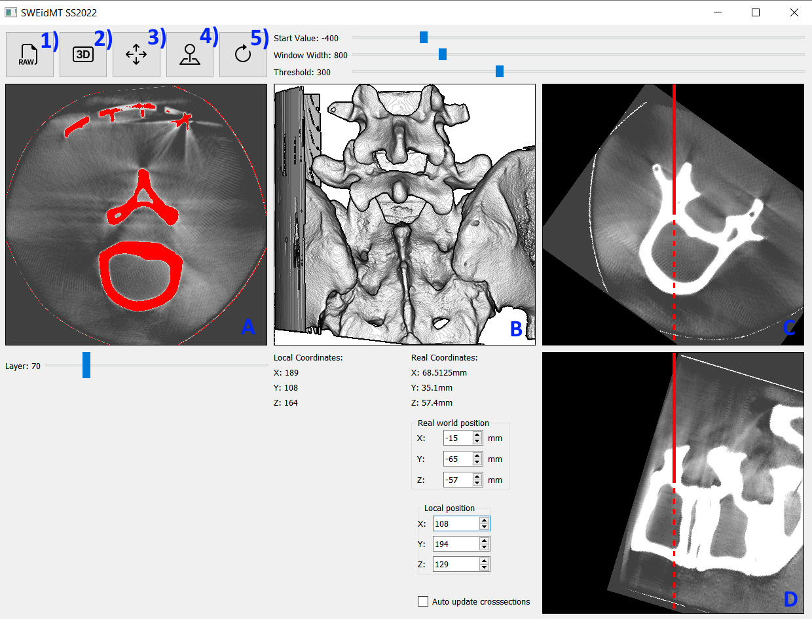

# SWEIDMT_SS2022_SIMON_MICHAU

Created during the course 'Softwareentwicklung in der Medizintechnik/Medical software engineering' in SS2022. The goal of this project is to create a software tool that can help with planning a vertebroplasty.

## Installation
After cloning the project you may need to add the eigen library:
```
git submodule add https://gitlab.com/libeigen/eigen.git eigen
git submodule init
git submodule update
```
After that you should be able to open the project in Qt and run it.

You can also [deploy](https://wiki.qt.io/Deploy_an_Application_on_Windows) the project as a .exe file

## Usage

Button 1) Open and load .raw file displaying a CT scan. This will also
- open a top view crosssection of the CT scan in frame A. You can scroll through it using the slider below.
- give a 3D visualization of the scan in frame B
- show two intersecting crosssections that display the position of the instrument in the model in frames C and D
Try it out with the included SpineModel_0.365_0.325_1_400_400_400.raw
Button 2) Update 3D model (e.g. after updating the start value and window width for windowing)
Button 3) [Region growing](https://en.wikipedia.org/wiki/Region_growing). Select a seed to start from by clicking a voxel in frame A or B. The selected voxel is stated as 'Local coordinates'. From this seed the algorithm will iteratively add only those voxels that are over the specified threshold, therefore isolating the selected (bone)structure.
Button 4) Registers the markers of the pad on the patients back to be able to synchronize the instrument position with the position in the scan. Will also display the markers and their centroids in frame B.
Button 5) Update crosssections. Only necessary if 'Auto update crosssections' isn't checked. Will update frames C and D with the new given values.

Using the sliders 'Start value' and 'Window width' we can select the windowing of the scan. This is necessary because the scan is more precise than a 256 bit grascale image could visualize. By windowing different density regions like bone or tissues can be inspected alone. Learn more [here](https://en.wikipedia.org/wiki/Hounsfield_scale).

## Authors and acknowledgment
Thanks to [Bootstrap](https://icons.getbootstrap.com/) for the icons.

## License
For open source projects, say how it is licensed.

## Project status
This project is finished.
